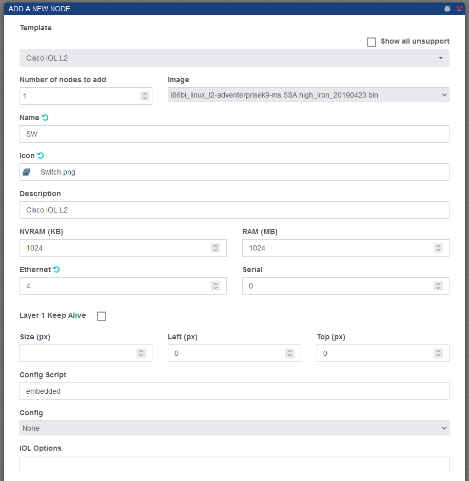

# Configurando nuestro primer switch

Usaremos la herramienta [ishare2](https://github.com/pnetlabrepo/ishare2) para descargar la imagen de nuestro primer switch, usaremos **"i86bi_linux_l2-adventerprisek9-ms.SSA.high_iron_20190423.bin"** como switch de capa 2/3, el uso que le daremos dependerá de lo que necesitamos, primeramente solo será de capa 2 así que tengan en cuenta eso.

Una vez esté instalada la imagen del switch iremos a nuestro laboratorio en PNETLab y agregaremos un nodo nuevo.

 

En esta imagen debemos de fijarnos en el nombre (Name), el icono (Icon) y el número de interfaces que se pondrán (Ethernet), cada "unidad" en Ethernet equivale a 4 interfaces de red.

Al finalizar los pasos tendremos nuestro switch listo para ser usado.

# Guardando el laboratorio actual

Primeramente debemos asegurarnos que la información de los dispositivos está guardada, esto depende del dispositivo pero por ejemplo para una VPC se usa el comando "save" y para el switch que acabamos de montar se usa "write" desde modo privilegiado.

Iremos a las opciones de Setup Nodes y Export all CFGs.

  

Una vez termine el proceso se verá así.

Por último tenemos que habilitar la carga de las configuraciones que guardamos, vamos a Startup Configs y seleccionamos ON en el apartado de Change All.

# Exportando nuestro laboratorio

Cerramos el laboratorio con la opción Close Lab, luego seleccionamos el laboratorio que queremos exportar y usamos la opción Export, nos descargará un archivo .zip el cual podremos compartir.

