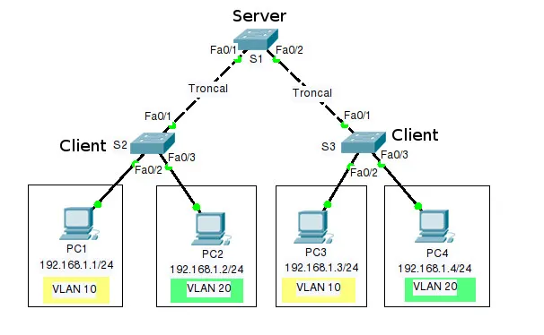

# Configuración de VTP

## Topología a realizar

<ol>
<li>Asignar el modo troncal a los enlaces correspondientes.</li>
En este caso serán las interfaces Fa0/1 y Fa0/2 del switch Server y Fa0/1 de ambos clientes.

### Server
    configure terminal
    interface range Fa0/1-2
    switchport trunk encapsulation dot1q
    switchport mode trunk

### Clientes
    configure terminal
    interface Fa0/1
    switchport trunk encapsulation dot1q
    switchport mode trunk

<li>Configurar el modo cliente en los switches clientes.</li>

### Clientes
    configure terminal
    vtp mode client
    vtp domain dominio
    vtp password contrasena
    do write

<li>Crear las VLAN en el switch que será el servidor.</li>

### Server
    configure terminal
    vlan 10
    name PRIMERA
    vlan 20
    name SEGUNDA
    end

<li>Configurar el modo servidor en el switch servidor.</li>

### Server
    configure terminal
    vtp version 2
    vtp mode server
    vtp domain dominio
    vtp password contrasena
    do write

<li>Comprobar que las VLAN se hayan propagado del servidor a los clientes.</li>

### Server
    show vlan brief
    show vtp status

### Clientes
    show vlan brief
    show vtp status

<li>Asignar el modo de acceso con VLAN a los enlaces correspondientes.</li>

### Clientes
    configure terminal
    interface Fa0/2
    switchport mode access
    switchport access vlan 10
    interface Fa0/3
    switchport mode access
    switchport access vlan 20
    do write
</ol>

## Configurando modo transparente

    vtp mode transparent
    vtp domain dominio
    vtp password contrasena

Debemos recordar que las VLANS no se propagan por lo que habrá que crearlas manualmente, luego se deben definir los puertos que irán en modo acceso.